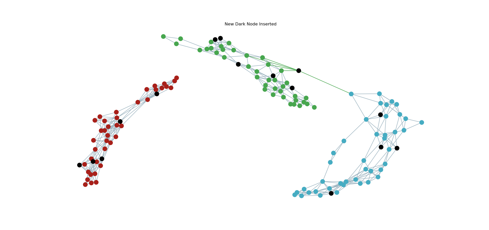

<div id="top"></div>

[![LinkedIn][linkedin-shield]][linkedin-url]
[![Contributors][contributors-shield]][contributors-url]
[![Forks][forks-shield]][forks-url]
[![Stargazers][stars-shield]][stars-url]
[![Issues][issues-shield]][issues-url]
[![GNU v3 License][license-shield]][license-url]


<!-- PROJECT LOGO -->
<br />
<div align="center">
  <a href="https://github.com/estebanvz/hl_classification_bc/">
    
  </a>

  <h3 align="center">A Network-Based High-Level Data Classification Algorithm
Using Betweenness Centrality
</h3>

  <p align="center">
    Published on DOI: https://doi.org/10.5753/eniac.2020.12128
    <br />
    <!-- <a href="https://github.com/estebanvz/hl_classification_bc"><strong>Explore the docs »</strong></a>
    <br /> -->
    <br />
    <a href="https://sol.sbc.org.br/index.php/eniac/article/view/12128">View Paper</a>
    ·
    <a href="https://github.com/estebanvz/hl_classification_bc/issues">Report Bug</a>
    ·
    <a href="https://github.com/estebanvz/hl_classification_bc/issues">Request Feature</a>
  </p>
</div>


<!-- TABLE OF CONTENTS
<details>
  <summary>Table of Contents</summary>
  <ol>
    <li>
      <a href="#about-the-project">About The Project</a>
      <ul>
        <li><a href="#built-with">Built With</a></li>
      </ul>
    </li>
    <li>
      <a href="#getting-started">Getting Started</a>
      <ul>
        <li><a href="#prerequisites">Prerequisites</a></li>
        <li><a href="#installation">Installation</a></li>
      </ul>
    </li>
    <li><a href="#usage">Usage</a></li>
    <li><a href="#roadmap">Roadmap</a></li>
    <li><a href="#contributing">Contributing</a></li>
    <li><a href="#license">License</a></li>
    <li><a href="#contact">Contact</a></li>
    <li><a href="#acknowledgments">Acknowledgments</a></li>
  </ol>
</details> -->


<!-- ABOUT THE PROJECT -->
## About The Paper

Data classification is a major machine learning paradigm, which has been widely applied to solve a large number of real-world problems. Traditional data classification techniques consider only physical features (e.g., distance, similarity, or distribution) of the input data. For this reason, those are called low-level classification. On the other hand, the human (animal) brain performs both low and high orders of learning, and it has a facility in identifying pat-terns according to the semantic meaning of the input data. Data classification that considers not only physical attributes but also the pattern formation is referred to as high-level classification. Several high-level classification techniques have been developed, which make use of complex networks to characterize data patterns and have obtained promising results. In this paper, we propose a pure network-based high-level classification technique that uses the betweenness centrality measure. We test this model in nine different real datasets and compare it with other nine traditional and well-known classification models. The results show us a competent classification performance.

<p align="right">(<a href="#top">back to top</a>)</p>


### Built With

This project was builded with the next technologies.

* [Python](https://python.org/)
* [Jupyter](https://jupyter.org/)
* [Pyswarms](https://pyswarms.readthedocs.io/)
* [Networkx](https://networkx.org/)
* [Scikit-learn](https://scikit-learn.org/)

<p align="right">(<a href="#top">back to top</a>)</p>


<!-- GETTING STARTED -->
## Getting Started


### Prerequisites

You need the next componenets to run this project.
* Docker. To install it follow these steps [Click](https://docs.docker.com/get-docker/). 
  On Ubuntu, you can run:
```sh
sudo apt-get install docker-ce docker-ce-cli containerd.io
```
* Visual Studio Code. To install it follow these steps [Click](https://code.visualstudio.com/download). On Ubuntu, you can run:
```sh
sudo snap install code --classic
```
* Install the visual studio code extension "Remote - Containers"
### Installation

Follow the next steps:

1. Run the visual studio code.
2. Open the folder where you clone the repository.
3. Click on the green button with this symbol in the bottom left of visual studio code "><".
4. Click on reopen in a container.
5. Execute "**main.py**".
<p align="right">(<a href="#top">back to top</a>)</p>

### Usage

You can use the **HLNB_BC** as a classifier of scikit-learn. Just need train and predict.
```python
classifier = HLNB_BC()
classifier.fit(dataset["data"], dataset["target"])
classifier.predict(dataset_test["data"])
```

<!-- USAGE EXAMPLES
## Usage

Use this space to show useful examples of how a project can be used. Additional screenshots, code examples and demos work well in this space. You may also link to more resources.

_For more examples, please refer to the [Documentation](https://example.com)_

<p align="right">(<a href="#top">back to top</a>)</p>


<!-- ROADMAP -->
<!-- ## Roadmap

- [x] Add Changelog
- [x] Add back to top links
- [ ] Add Additional Templates w/ Examples
- [ ] Add "components" document to easily copy & paste sections of the readme
- [ ] Multi-language Support
    - [ ] Chinese
    - [ ] Spanish

See the [open issues](https://github.com/estebanvz/hl_classification_bc/issues) for a full list of proposed features (and known issues).

<p align="right">(<a href="#top">back to top</a>)</p> -->

<!-- LICENSE -->
## License

Distributed under the GNU v3 License. See `LICENSE` for more information.

<p align="right">(<a href="#top">back to top</a>)</p>


<!-- CONTACT -->
## Contact

Esteban Vilca - [@ds_estebanvz](https://twitter.com/ds_estebanvz) - [esteban.wilfredo.g@gmail.com](mailto:esteban.wilfredo.g@gmail.com)

Project Link: [https://github.com/estebanvz/hl_classification_bc](https://github.com/estebanvz/hl_classification_bc)

<p align="right">(<a href="#top">back to top</a>)</p>


<!-- MARKDOWN LINKS & IMAGES -->
<!-- https://www.markdownguide.org/basic-syntax/#reference-style-links -->
[contributors-shield]: https://img.shields.io/github/contributors/estebanvz/hl_classification_bc.svg
[contributors-url]: https://github.com/estebanvz/hl_classification_bc/graphs/contributors
[forks-shield]: https://img.shields.io/github/forks/estebanvz/hl_classification_bc.svg
[forks-url]: https://github.com/estebanvz/hl_classification_bc/network/members
[stars-shield]: https://img.shields.io/github/stars/estebanvz/hl_classification_bc.svg
[stars-url]: https://github.com/estebanvz/hl_classification_bc/stargazers
[issues-shield]: https://img.shields.io/github/issues/estebanvz/hl_classification_bc.svg
[issues-url]: https://github.com/estebanvz/hl_classification_bc/issues
[license-shield]: https://img.shields.io/github/license/estebanvz/hl_classification_bc.svg
[license-url]: https://github.com/estebanvz/hl_classification_bc/blob/main/LICENSE
[linkedin-shield]: https://img.shields.io/badge/-LinkedIn-black.svg?=linkedin&colorB=888
[linkedin-url]: https://linkedin.com/in/estebanvz
[product-screenshot]: images/screenshot.png